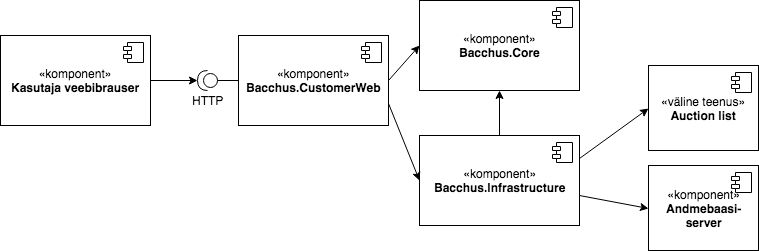

# Rakenduse käivitamine

Rakendus töötab .Net Core 2.2 raamistikul, mille paigaldusfailid leiab lehe https://dotnet.microsoft.com/download/dotnet-core/2.2 peatükist Runtime 2.2.0.
Järgnevalt, olles rakenduse juurkaustas tuleb käivitada:
```
dotnet run --project src/Bacchus.CustomerWeb/Bacchus.CustomerWeb.csproj
```
Rakendus käivitati edukalt kui ta kirjutas konsooli read
```
Now listening on: http://localhost:5000
Application started. Press Ctrl+C to shut down.
```

Rakendust saab kasutada avades brauseris http://localhost:5000/
Kõiki salvestatud pakkumisi saab vaadata aadressilt http://localhost:5000/BidList

# Rakenduse ülesehitusest
Rakenduse koostamisel lähtusin Microsofti soovitatud arenduspõhimõtetest kasutades allikana "Architecting Modern Web Applications with ASP.NET Core and Azure" (https://docs.microsoft.com/en-us/dotnet/standard/modern-web-apps-azure-architecture/) näidisrakendust.
Lahendus on jagatud 3 komponendiks ning nende vahelised seosed on kirjeldatud alljärgneval skeemil.

Vastutus komponentide vahel on jagatud alljärgnevalt:
* Bacchus.CustomerWeb tegeleb veebirakenduse spetsiifiliste asjadega ning rakenduse seadistustele vastavalt käivitamisega.
* Bacchus.Core defineerib andmestruktuurid ning äriteenused.
* Bacchus.Infrastrucure tegeleb andmebaasi, väliste teenuste ning rakenduse tasemel _cache_'ga.

Rakenduses kasutatud tehnoloogiad: 
* ASP.NET Core 2
* Entity Framework Core
* Newtonsoft JSON
* LINQ
* Razor Pages
* Bootstrap 4
* SQLite

Programmikoodis olen kasutanud mooduleid ka viidatud näidisrakendusest "Architecting Modern...". Kõik näidisrakendusest imporditud moodulid olen selguse huvides märgistanud kommentaariga:
```
// Based on  ASP.NET Core 2.1 reference application https://github.com/dotnet-architecture/eShopOnWeb
```
